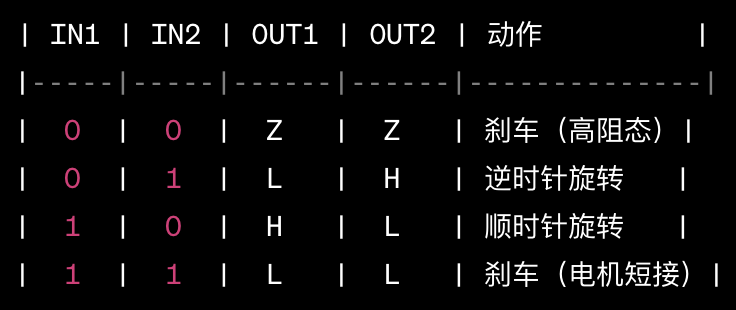

# DRV8833 module
Mind Plus block for DRV8833 motor driver module

* 德州仪器制造的DRV8833是一种H桥电机驱动器芯片，通常用于控制直流电机。
* 单块DRV8833模块支持最多2台电机
* 单块DRV8833模块电能转化效率为91%左右
* 操控单台电机的真值表如下：

其中： 
IN1和IN2是输入信号，可以是数字电平0或1。 
OUT1和OUT2是H桥的输出，表示电机的两个端口。 
Z表示高阻抗状态，即电机刹车。 
L表示逻辑低电平。 
H表示逻辑高电平。 

# Notice
* 本套积木块最多支持6台电机
* 需要使用3个DRV8833模块
* VCC 接电池正极
* GND 接电池负极
* 可用乐高标准的9V电池供电

# Block Description
* Use the first block to initialize the motor (M1-M6)
* Use the second block to set the motor moving direction; code generated in while loop
* Use the third block to set the speed of the motor, which requires the enable pins are connected (current disabled)

# Release Logs
* V0.0.1  Basic functions completed.
